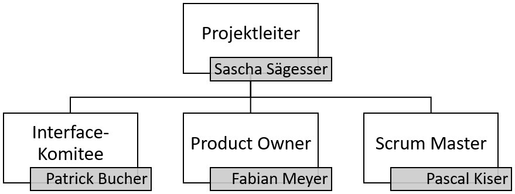

# Projektorganisation

**Version 1.0.0**

## Organisationsplan

## Rollen & Zuständigkeiten

### Rollen

- Projektleiter: Sascha Sägesser
- Interfacekomitee: Patrick Bucher
- Product Owner: Fabian Meyer
- Scrum Master: Pascal Kiser

### Zuständigkeit

- Dokumentation: Patrick Bucher
- Build: Pascal Kiser
- Testing: Fabian Meyer
- Codereview: Patrick Bucher
- Sprintreviews: Sascha Sägesser
- Meilensteinberichte: Fabian Meyer
- Risikomanagement: Pascal Kiser

# Projektführung

## Rahmenplan

Der Rahmenplan stellt eine Übersicht auf abstrakter Ebene dar. Die wichtigsten Elemente sind die definierten Meilensteine und Sprints. Dabei ist darauf zu achten, dass die Vorgaben der Aufgabenstellung, wie z.B. die Zwischen- und Schlussabgabe, von Anfang an in das Projekt miteingeplant werden.

## Meilensteinplan

Das komplette Projekt ist in vier Meilensteine aufgeteilt. Der erste Meilenstein entspricht dem Projektstart, also der ersten Vorlesung. Der zweite Meilenstein stellt den Start der Projektumsetzung dar und die beiden letzten Meilensteine ergeben sich aus der Zwischen- und Schlussabgabe. Zu jedem Meilenstein gibt es Deliverables:

1. Meilenstein (19.02.2018)
    - Auftrag "Message-Logger"
2. Meilenstein (12.03.2018)
    - ProductBacklog
    - Sprintplanung S1/S2
    - Detailplanung S1
    - Meilensteinbericht MS 2
3. Meilenstein (08.04.2018)
    - Release 1 gemäss Muss-Features deployed und lauffähig
    - Sprintplanung S3/S4
    - Meilensteinbericht MS 3
4. Meilenstein (13.05.2018)
    - Release 2 gemäss Muss-Features deployed und lauffähig
    - Meilensteinbericht MS 4

## Sprintplan

Die Projektdurchführung (MS 3 / 4) ist in vier Sprints aufgeteilt. Jeder Sprint dauert zwei Wochen. Die Detaillierte Sprintplanung ist mittels des Online-Tools "ScrumDo" realisiert.

| Sprint  | Termin     | Deliverables                        |
| ------: | ---------- | ----------------------------------- |
| 1       | 25.03.2018 | Sprintreview S1, Sprintplanung S2   |
| 2       | 08.04.2018 | Sprintreview S2, Sprintplanung S3   |
| 3       | 29.04.2018 | Sprintreview S3, Sprintplanung S4   |
| 4       | 13.05.2018 | Sprintreview S4                     |

## Projektstrukturplan

Um das Projekt besser planen, durchzuführen und kontrollieren zu können, ist dieses in mehrere Teilprojekte, welche wiederum in Teilaufgaben gegliedert sind, aufgeteilt.

## Aufwandschätzung
## Ressourcenplan
## Projektkontrolle

# Projektunterstützung

## Tools für Entwicklung, Test & Abnahme

**Hinweis:** Dieses Kapitel wird noch erweitert.

Für das **Projektmanagement** sind folgende Tools im Einsatz:

| Bereich                | Tool                                                       |
|------------------------|------------------------------------------------------------|
| Vorgehensmodell: Scrum | ScrumDo                                                    |
| Datenaustausch         | GitHub                                                     |
| Dokumentation          | Markdown, Pandoc, Microsoft Office 2016, draw.io, plantuml |

Für die **Entwicklung** sind folgende Tools im Einsatz:

| Bereich                | Tool                                      |
| --------------------   | ----------------------------------------- |
| Entwicklungsumgebung   | ItelliJ IDEA 2017, Eclipse                |
| Programmiersprache     | Java 1.8                                  |
| Versionskontrolle      | git, GitLab                               |
| Testing                | JUnit, Integrationstests, Systemtests     |
| Continuous Integration | Jenkins                                   |

## Konfigurationsmanagement

Das Konfigurationsmanagement soll die Einhaltung von Regeln für einen organisatiorischen und verhaltensmässigen Lebenslauf eines Produkts und seiner Configuration Items (Konfigurationseinheiten) gewährleisten.

Ein Configuration Item ist eine beliebige Kombination aus Hardware, Software oder Dienstleistung. In diesem Projekt sind diese die Dokumentationen, Komponenten und Interfaces. Im Kapitel "Releasemanagement" sind diese ausführlich aufgelistet.

## Releasemanagement

Das Releasemanagement befasst sich mit der Planung und Durchführung der Veröffentlichung. Dieses Projekt beinhaltet zwei Releases:

- Release 1: Zwischenabgabe (SW08)
- Release 2: Schlussgabe (SW13)

| Configuration Item    | Release 1 | Release 2 |
| --------------------- | --------- | --------- |
| Projektmanagementplan |           |           |
| Systemspezifikation   |           |           |
| Logger                |           |           |
| LoggerSetup           |           |           |
| LoggerCommon          |           |           |
| LoggerComponent       |           |           |
| LoggerServer          |           |           |
| StringPersistor       |           |           |
| StringPersistorFile   |           |           |
| GameOfLife            |           |           |

# Testplan
## Testdesign & Abläufe
## Testfälle

# Anhänge
## Sprintreview
## Meilensteinreview
